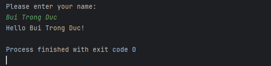
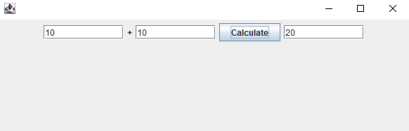
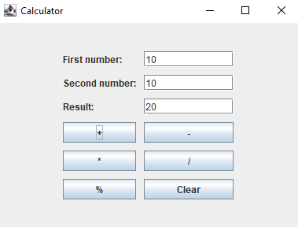

# BTVN Tuần 1

Họ và tên: Bùi Trọng Đức

MSSV: 20200157

Lớp: 143801 - IT4490 - Thiết kế và xây dựng phần mềm

## Câu 1

**Xây dựng chương trình HelloWorld với ngôn ngữ Java, nhập vào họ tên và in ra màn hình dòng chữ "Hello World, <họ tên>".**

Mã chương trình nằm trong folder `HelloWorld`.

Sau đây là hình ảnh khi chương trình thực thi:

## Câu 2

**Đọc hiểu và triển khai chương trình `MVCTutorial`**

Mã chương trình nằm trong folder `MVCTutorial`.

Sau đây là hình ảnh của chương trình sau khi thực thi:

Giải thích về cấu trúc mã nguồn:

Đây là một chương trình MVC đơn giản, bao gồm 3 thành phần chính: Model (`CalculatorModel.java`), View (`CalculatorView.java`) và Controller (`CalculatorController.java`).

- **Model**: Chứa hàm tính toán cộng 2 số cho nhau `addTwoNumbers(int firstNumber, int secondNumber)` và hàm lấy kết quả của phép tính bằng hàm `getCalculationValue()`.

- **View**: Chứa giao diện người dùng, bao gồm 2 ô nhập số và 1 ô hiển thị kết quả cùng với một nút click để thực hiện tính toán. Người dùng nhập 2 số vào 2 ô nhập số, sau đó nhấn nút click để thực hiện phép tính. Kết quả sẽ được hiển thị ở ô hiển thị kết quả.

- **Controller**: Đóng vai trò trung gian kết nối **View** với **Model**. Khi khởi tạo **Controller**, nó sẽ cần truyền vào một **Model** và một **View**, và thiết lập sự kiện click tính toán cho **View**. Sau đó, nó sẽ lắng nghe sự kiện click của nút click ở **View**. Khi người dùng nhấn nút click, **Controller** sẽ lấy 2 số từ **View** và gọi hàm `addTwoNumbers()` của **Model** để tính toán. Sau đó, **Controller** sẽ gọi hàm `setCalcSolution()` của **View** để hiển thị kết quả tính toán.

## Câu 3

**Triển khai chương trình `Calculator` sử dụng Swing hoặc JavaFX**

Mã chương trình nằm trong folder `Calculator`.

Sau đây là hình ảnh của chương trình sau khi thực thi:

Giải thích về cấu trúc mã nguồn:

Đây là một chương trình MVC đơn giản, bao gồm 3 thành phần chính: Model (`CalculatorModel.java`), View (`CalculatorView.java`) và Controller (`CalculatorController.java`).

- **Model**: Chứa các phép tính cộng/trừ/nhân/chia/modulus cũng như hàm lấy kết quả của phép tính bằng hàm `getCalculationValue()`.

- **View**: Chứa giao diện người dùng, bao gồm 2 ô nhập số và 1 ô hiển thị kết quả cùng với các nút click để thực hiện các phép tính. Người dùng nhập 2 số vào 2 ô nhập số, sau đó nhấn nút click để thực hiện phép tính. Kết quả sẽ được hiển thị ở ô hiển thị kết quả.

- **Controller**: Đóng vai trò trung gian kết nối **View** với **Model**. Khi khởi tạo **Controller**, nó sẽ cần truyền vào một **Model** và một **View**, và thiết lập sự kiện click tính toán cho **View**. Sau đó, nó sẽ lắng nghe sự kiện click của các nút click ở **View**. Khi người dùng nhấn nút click, **Controller** sẽ lấy 2 số từ **View** và gọi hàm tương ứng của **Model** để tính toán. Sau đó, **Controller** sẽ gọi hàm `setCalcSolution()` của **View** để hiển thị kết quả tính toán.
